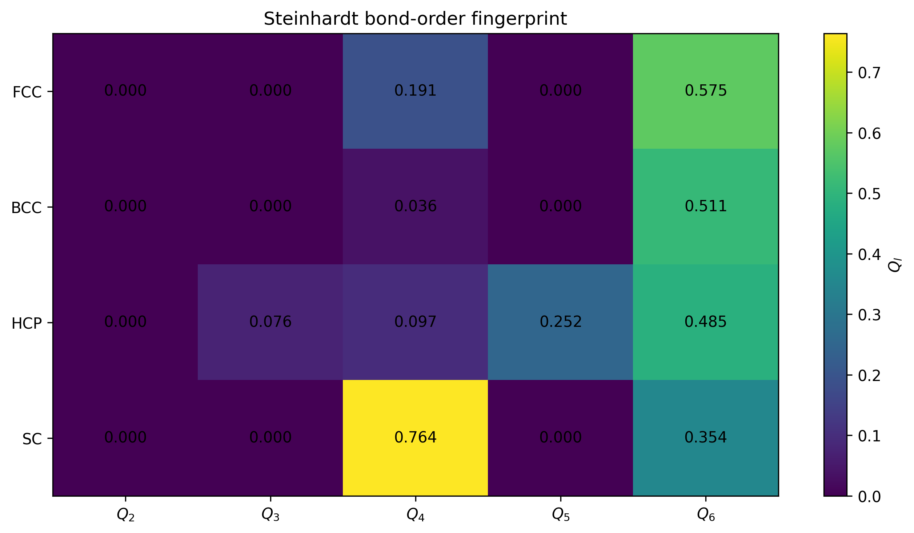
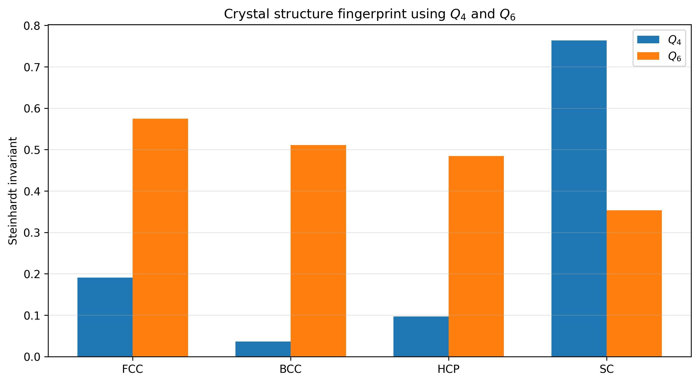
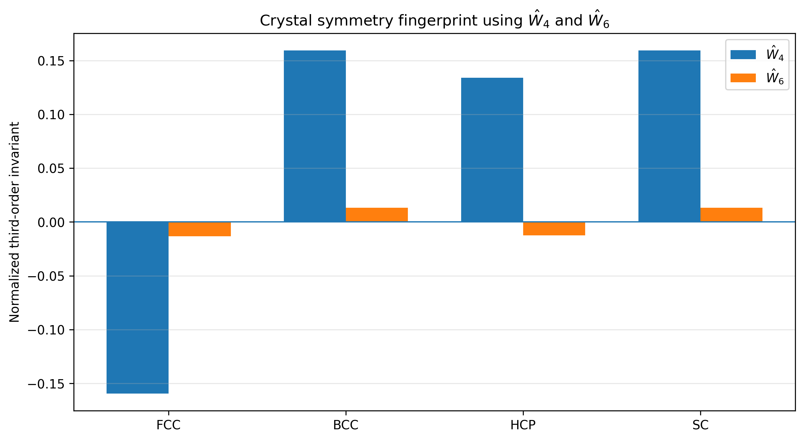

# Steinhardt Bond-Orientational Order Parameters

A small Python implementation of the Steinhardt bond-orientational order parameters for analysing local and global atomic structure.

The code calculates

- \(Q_l\): second-order, norm-like rotational invariant
- \(W_l\): third-order rotational invariant obtained from cubic scalar coupling
- \(\hat{W}_l\): normalized third-order invariant

The numerical kernels are accelerated with Numba, while ASE is used for structure reading and neighbour-list construction.

---

## Method

For a central atom \(i\) with \(N_b\) neighbours, the local spherical-harmonic coefficients are calculated as

$$
q_{lm}(i)=
\frac{1}{N_b}
\sum_{j=1}^{N_b}
Y_{lm}(\theta_j,\phi_j)
$$

where \(Y_{lm}\) are the spherical harmonics evaluated along the neighbour bond directions.

The second-order rotational invariant is

$$
Q_l(i)=
\sqrt{
\frac{4\pi}{2l+1}
\sum_{m=-l}^{l}
|q_{lm}(i)|^2
}
$$

The third-order invariant is obtained by coupling three \(q_{lm}\) components using the Wigner 3-j symbol:

$$
W_l(i)=
\sum_{m_1+m_2+m_3=0}
\begin{pmatrix}
l & l & l\\
m_1 & m_2 & m_3
\end{pmatrix}
q_{lm_1}(i)
q_{lm_2}(i)
q_{lm_3}(i)
$$

The normalized third-order invariant is

$$
\hat{W}_l(i)=
\frac{
W_l(i)
}{
\left(
\sum_{m=-l}^{l}
|q_{lm}(i)|^2
\right)^{3/2}
}
$$

The implementation also provides global descriptors, where the averaging is performed over all bonds in the configuration instead of the neighbourhood of a single atom.

---

## Results

The implementation was checked using ideal FCC, BCC, HCP and simple-cubic structures.

### Bond-order fingerprint



The different crystal structures produce clearly different \(Q_l\) fingerprints.  
For example, FCC is characterized by relatively large \(Q_6\), while simple cubic has a much larger \(Q_4\).

### Common \(Q_4\)-\(Q_6\) fingerprints



\(Q_4\) and \(Q_6\) already provide a useful way of distinguishing the tested crystal structures.

### Normalized third-order invariants



The normalized third-order invariants provide additional symmetry information.  
In particular, both the magnitude and sign of \(\hat{W}_4\) and \(\hat{W}_6\) help distinguish different local environments.

---

## Reference values

| Structure | Neighbours | \(Q_4\) | \(Q_6\) | \(\hat{W}_4\) | \(\hat{W}_6\) |
|---|---:|---:|---:|---:|---:|
| FCC | 12 | 0.190941 | 0.574524 | -0.159317 | -0.013161 |
| HCP | 12 | 0.097222 | 0.484762 | 0.134097 | -0.012442 |
| BCC, first shell | 8 | 0.509175 | 0.628539 | -0.159317 | 0.013161 |
| BCC, first + second shell | 14 | 0.036370 | 0.510688 | 0.159317 | 0.013161 |
| Simple cubic | 6 | 0.763763 | 0.353553 | 0.159317 | 0.013161 |

For the perfect FCC structure, for example,

\[
Q_2 \approx 0, \qquad Q_4 = 0.190941, \qquad Q_6 = 0.574524
\]

The very small calculated values at theoretically vanishing orders are numerical round-off.

---

## Usage

```python
from steinhardt import calculate_steinhardt_descriptors

features = calculate_steinhardt_descriptors(
    "structures/fcc_perfect_crystal.lmp",
    file_format="lammps-data",
    cutoff=3.2,
    l_values=(4, 6),
    pbc=(True, True, True),
    include_q=True,
    include_w=True,
    include_w_hat=True,
)
